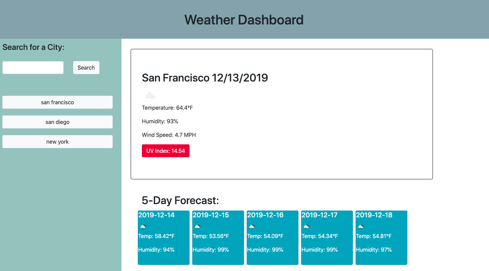

# Weather Dashboard

This weather dashboard allows users to search for a city and get its current weather and a 5 day forecast. Searched cities appear on the side, so users can click back onto those cities if they want. The 5 day forecast includes the date, an icon image of the weather, the temperature, and the humidity. The OpenWeather API is utilized to get weather information and append it to the page dynamically.



## Deployed Link

[See Live Site](https://xrachhel.github.io/weatherDashboard/)

## Technologies Used

* [HTML](https://developer.mozilla.org/en-US/docs/Web/HTML): used for structuring and creating elements on the DOM
* [CSS](https://developer.mozilla.org/en-US/docs/Web/CSS): used to style html elements on the page
* [Javascript](https://developer.mozilla.org/en-US/docs/Web/JavaScript): used to create responsive, interactive elements on the page
* [Jquery](https://jquery.com/): Javascript library to simplify HTML DOM traversal
* [Moment.js](https://momentjs.com/): JavaScript library to parse, validate, manipulate, and display dates and times

## Code snippet 
```html
function displayWeather(city){
    
    console.log(city)
    var queryURL = "https://api.openweathermap.org/data/2.5/weather?q=" + city + "&units=imperial&appid=81481b28398acfb07db612f9d04e7e45" 

    $.ajax({
      url: queryURL,
      method: "GET"
    }).then(function(response){
      console.log(response)
      
      $("#name").html("<h2>" + response.name + " " + date + "</h2>")
      $("#temp").html("<p> Temperature: " + response.main.temp + "°F")
      $("#humidity").html("<p> Humidity: " + response.main.humidity + "%</p>")
      $("#wind").html("<p> Wind Speed: " + response.wind.speed + " MPH</p>")
      console.log(response.weather[0].main)

      var main = response.weather[0].main
      if(main === "Rain"){
          var icon = $("").attr("src", "http://openweathermap.org/img/wn/09d.png")
          $("#img").html(icon)
      }
      else if (main === "Clear"){
        var icon = $("").attr("src", "http://openweathermap.org/img/wn/01d.png")
        $("#img").html(icon)
      }
      else if (main === "Mist"){
        var icon = $("").attr("src", "http://openweathermap.org/img/wn/50d.png")
        $("#img").html(icon)
      }
      else if (main === "Clouds"){
        var icon = $("").attr("src", "http://openweathermap.org/img/wn/03d.png")
        $("#img").html(icon)
      }
      else if (main === "Snow"){
        var icon = $("").attr("src", "http://openweathermap.org/img/wn/13d.png")
        $("#img").html(icon)
      }
      else if (main === "Drizzle"){
        var icon = $("").attr("src", "http://openweathermap.org/img/wn/10d.png")
        $("#img").html(icon)
      }

      var lat = response.coord.lat
      var lon = response.coord.lon
      console.log(lat)
      console.log(lon)
      var uvURL = "http://api.openweathermap.org/data/2.5/uvi/forecast?appid=81481b28398acfb07db612f9d04e7e45&lat=" + lat + "&lon=" + lon 

    $.ajax({
        url: uvURL,
        method: "GET"
    }).then(function(response){
        console.log(response)
        console.log(response[0].value)
        if (response[0].value >= "8"){
            var uv = "UV Index:  " + response[0].value
            var uvBtn = $("<button></button>").text(uv)
            uvBtn.addClass("btn btn-danger")
            $("#uv").html(uvBtn)
        }
        else if (response[0].value >= "3" && response[0].value <= "7" ){
            var uv = "UV Index:  " + response[0].value
            var uvBtn = $("<button></button>").text(uv)
            uvBtn.addClass("btn btn-warning")
            $("#uv").html(uvBtn)
        }
        else if (response[0].value < "3"){
            var uv = "UV Index:  " + response[0].value
            var uvBtn = $("<button></button>").text(uv)
            uvBtn.addClass("btn btn-success")
            $("#uv").html(uvBtn)
        }
        
        
    })
    })
    
}
```
This was the function used to display the daily weather based on the city searched by the user. An AJAX call was first made to the OpenWeather API, which then displayed the information needed in dynamically made heading and paragraph tags. Conditional statements were used to to set the image icons using information from the API call. An AJAX call is nested within the original AJAX call to get the UV index by grabbing the longitude and latitude from the first AJAX call and set those as variables for the UV AJAX call. Another conditional statement is used to set the color of the UV info button based on the number(red for high, orange for middle, and green for low values).

## Authors

**Rachel Yeung**
* [Portfolio](https://rachelyeung.herokuapp.com/)
* [Github](https://github.com/xrachhel)
* [LinkedIn](https://www.linkedin.com/in/rachel-yeung-814986159/)